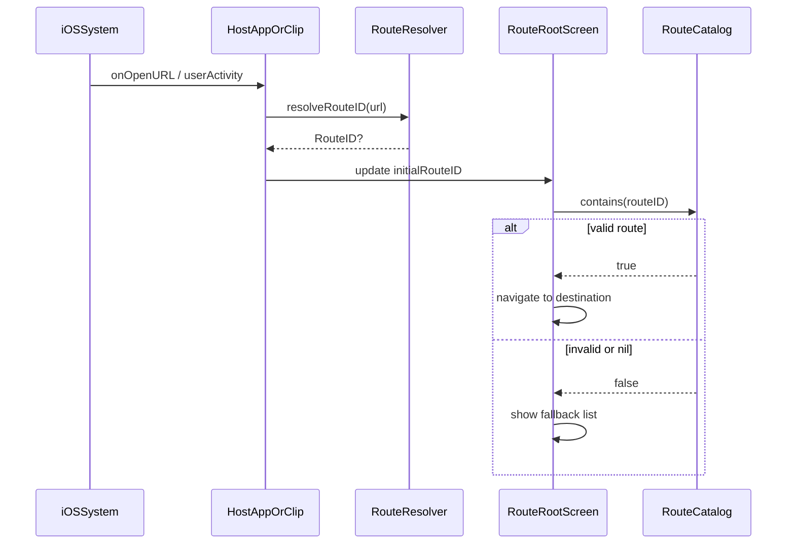

# App Clip Runbook（日本語）

## URLルーティング
- GitHub Pages プロジェクトサイト: `/my-toybox-clip/<screen-id>`（ホスト直下から **2 要素**: `my-toybox-clip`、`<screen-id>`）
- クエリルート: `?screen=<screen-id>`（パスより優先）
- 厳密パス規則: 上記の **2 要素パターン**のみ受理。それ以外の区切り数・先頭セグメントは拒否
- **廃止**（意図的に未対応）: `/clip/<screen-id>`、`/.well-known/clip/<screen-id>`
- デコード方針: Foundation のURLパースにより1回だけデコード（追加の手動percent-decodingなし）
- `screen-id` が不明な場合: アプリクリップの一覧ビューへフォールバック
- ルート解析は `RouteResolver` に集約

## 公開インターフェース契約
- `RouteID`: アプリ間で受け渡す外部向けルート識別子
- `RouteCatalog`: クリップアイテムとルート可否のSSOT（Single Source of Truth）
- `RouteRootScreen`: App Clip と、フルアプリ側のフォールバック表示の両方で利用する公開エントリビュー
- `Screen` は `MyToyboxCatalog` 内部（internal）のままであり、`App/*` から参照してはならない

## 呼び出し元
- App Clip Code
- NFC
- QR
- URL（Safari / Messages / Notes）

呼び出し元はすべて、上記の同じURLルールへ解決されなければならない

## ルーティングシーケンス

## Code-to-spec mapping
この Runbook が記述するふるまいは、次のコードパスで同等に強制されています。

- URL パースの不変条件 => `RouteResolver.resolveRouteID(from:)`
  - 入力: OS から渡される URL (`onOpenURL` / `userActivity`)
  - 判断:
    - クエリ `screen=<screen-id>` が存在し空でなければそれを優先
    - それ以外は `/my-toybox-clip/<screen-id>`（2 要素）のみ許可
    - percent-decoding は Foundation のURLパースで1回だけ処理され、追加の手動 percent-decoding は行わない
  - 出力: `RouteID`（`rawValue` に基づく）または `nil`

- ルートの利用可能性とフォールバック => `RouteCatalog.contains(_:)` と `RouteRootScreen`
  - 入力: `initialRouteID`
  - 判断:
    - `contains(routeID)` が `true` の場合、`RouteRootScreen` は NavigationStack の path を `[routeID]` に設定する
    - それ以外は path を空にして、フォールバックの一覧 UI を表示する

- rawValue コントラクト => `RouteID` と内部 `Screen.rawValue`
  - 不変条件: `RouteID.rawValue` は内部 `Screen.rawValue` と 1:1 対応する case name（大文字/小文字を含めて一致が必要）

## Percent-decoding境界テストケース
> 仕様固め用: `RouteResolver` の現行実装（query優先、厳密 path が「2 要素 `my-toybox-clip/<id>`」、手動 percent-decoding なし、decode once は Foundation に委譲）に基づく期待値。表中の `example.com` はサイトルートの例であり、実運用では `https://koshimizu-takehito.github.io/my-toybox-clip/...` などに読み替え可能。

| # | Input URL（代表） | Resolver output（RouteID?.rawValue or nil） | RouteCatalog.contains? | UI outcome | 理由 |
|---:|---|---|---|---|---|
| 1 | `https://example.com/my-toybox-clip/badgeDemoScreen?screen=ringSliderScreen` | `ringSliderScreen` | true | destination | query優先 |
| 2 | `https://example.com/?screen=ring%53liderScreen` | `ringSliderScreen` | true | destination | `%53` decode once（Foundation） |
| 3 | `https://example.com/?screen=badge%64emoScreen` | `badgeDemoScreen` | true | destination | `%64` decode once（Foundation） |
| 4 | `https://example.com/?screen=ring%2553liderScreen` | `ring%53liderScreen` | false | fallback | double-encoding: `%25`→`%`のみ残り routeID不一致 |
| 5 | `https://example.com/my-toybox-clip/ringSliderScreen` | `ringSliderScreen` | true | destination | strict path（2要素のみ） |
| 6 | `https://example.com/my-toybox-clip/ring%53liderScreen` | `ringSliderScreen` | true | destination | `%53` decode once（Foundation）で2要素維持 |
| 7 | `https://example.com/foo/my-toybox-clip/ringSliderScreen` | nil | false | fallback | strict path reject（要素数3） |
| 8 | `https://example.com/my-toybox-clip/ringSliderScreen/extra` | nil | false | fallback | strict path reject（末尾追加で要素数3） |
| 9 | `https://example.com/my-toybox-clip/ring%2FsliderScreen` | nil | false | fallback | encoded slash `%2F` decode once→`/`で要素数が崩れて reject |
| 10 | `https://example.com/?screen=ring%2FsliderScreen` | `ring/sliderScreen` | false | fallback | query decode onceで`/`が混入し routeID不一致 |
| 11 | `https://example.com/my-toybox-clip/` | nil | false | fallback | empty id reject（要素数1） |
| 12 | `https://example.com/?screen=` | nil | false | fallback | empty value reject |
| 13 | `https://example.com/?screen=RingSliderScreen` | `RingSliderScreen` | false | fallback | case-sensitive（routeID不一致） |
| 14 | `https://example.com/foo/my-toybox-clip/ringSliderScreen?screen=badgeDemoScreen` | `badgeDemoScreen` | true | destination | query優先のため path reject を無視 |
| 15 | `https://koshimizu-takehito.github.io/my-toybox-clip/ringSliderScreen` | `ringSliderScreen` | true | destination | 本番 GitHub Pages URL |
| 16 | `https://example.com/other-repo/ringSliderScreen` | nil | false | fallback | 先頭セグメントが `my-toybox-clip` でない |
| 17 | `https://example.com/clip/ringSliderScreen` | nil | false | fallback | 廃止パス（未対応） |

### 注記
- Resolverの出力は `RouteResolver` の返り値に基づく。
- UI outcome は `RouteRootScreen` が `RouteCatalog.contains(routeID)` によって fallback list / destination を決める。
- decode once の期待値は Foundation のURLパース挙動に依存するため、将来差分が出た場合は表も更新する。

## 関連ドメイン
- 次でアプリ/クリップ双方の entitlements を設定する:
  - `applinks:<your-domain>`
  - `appclips:<your-domain>`（クリップターゲット）
- 設定ごとに `APP_CLIP_ASSOCIATED_DOMAIN` のビルド設定を更新する。

## 検証チェックリスト
- App / App Clip ターゲットが `Screen` を直接参照せずにコンパイルできること
- Notes/Safari から開くURLが期待した画面に解決されること
- QR/NFC/App Clip Code の呼び出しが同じ画面マッピングへ解決されること
- フルアプリが同じURLを受け取り、マッピングされた画面を表示すること
- 呼び出し元ごとに実機でコールドスタート時間を記録すること
- リリース前に App Clip のバイナリサイズを監視すること
