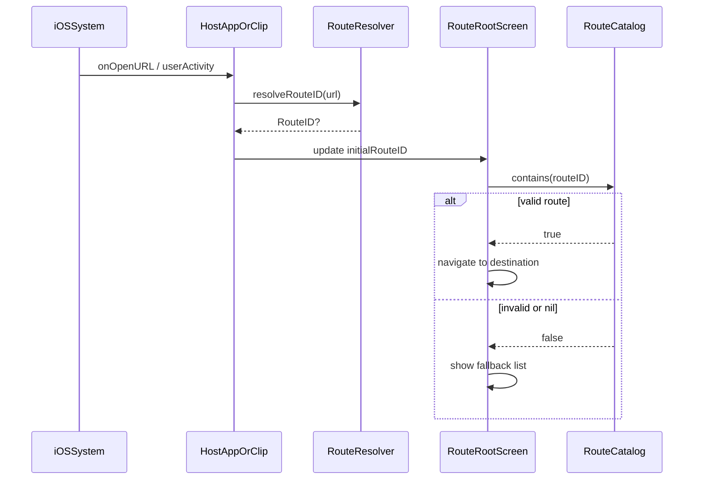

# App Clip Runbook

## URL Routing
- GitHub Pages project site: `/my-toybox-clip/<screen-id>` (exactly two path segments from the host root: `my-toybox-clip`, `<screen-id>`).
- Query route: `?screen=<screen-id>` (higher priority than path)
- Strict path rule: accept only the **two-segment** pattern above; reject any other component counts or leading segments.
- Deprecated (intentionally unsupported): `/clip/<screen-id>`, `/.well-known/clip/<screen-id>`.
- Decoding policy: decode once via Foundation URL parsing (no extra manual percent-decoding).
- Unknown `screen-id`: falls back to the App Clip list view.
- Route parsing is centralized in `RouteResolver`.

## Public Interface Contract
- `RouteID`: external route identifier passed between app layers.
- `RouteCatalog`: single source of truth for clip items and route availability.
- `RouteRootScreen`: public clip entry view for both App Clip and full app fallback presentation.
- `Screen` remains internal to `MyToyboxCatalog` and must never be referenced in `App/*`.

## Invocation Sources
- App Clip Code
- NFC
- QR
- URL (Safari / Messages / Notes)

All invocation sources must resolve to the same URL rule above.

## Routing Sequence

## Code-to-spec mapping
This runbook describes the same behavior enforced by the following code paths:

- URL parsing invariants => `RouteResolver.resolveRouteID(from:)`
  - Input: URL provided by the OS (`onOpenURL` / `userActivity`).
  - Decision:
    - Query `screen=<screen-id>` wins when present and non-empty.
    - Otherwise accept only `/my-toybox-clip/<screen-id>` (2 components).
    - Percent-decoding is handled once by Foundation URL parsing (no extra manual percent-decoding).
  - Output: `RouteID` (based on `rawValue`) or `nil`.

- Route availability and fallback => `RouteCatalog.contains(_:)` and `RouteRootScreen`
  - Input: `initialRouteID`.
  - Decision:
    - If `contains(routeID)` is true, `RouteRootScreen` sets the navigation stack path to `[routeID]`.
    - Otherwise, it clears the path so the UI shows the fallback list.

- rawValue contract => `RouteID` + internal `Screen.rawValue`
  - Invariant: `RouteID.rawValue` is a case name that matches internal `Screen.rawValue` 1:1 (case-sensitive).

## Percent-decoding boundary test cases
> Spec lock-in: expected values based on the current `RouteResolver` implementation (query priority, strict path of exactly 2 components `my-toybox-clip/<id>`, no additional manual percent-decoding, and decode-once delegated to Foundation URL parsing). `example.com` denotes a site root; production may use `https://koshimizu-takehito.github.io/my-toybox-clip/...`.

| # | Input URL (example) | Resolver output (RouteID?.rawValue or nil) | RouteCatalog.contains? | UI outcome | Reason |
|---:|---|---|---|---|---|
| 1 | `https://example.com/my-toybox-clip/badgeDemoScreen?screen=ringSliderScreen` | `ringSliderScreen` | true | destination | query priority |
| 2 | `https://example.com/?screen=ring%53liderScreen` | `ringSliderScreen` | true | destination | `%53` decoded once (Foundation) |
| 3 | `https://example.com/?screen=badge%64emoScreen` | `badgeDemoScreen` | true | destination | `%64` decoded once (Foundation) |
| 4 | `https://example.com/?screen=ring%2553liderScreen` | `ring%53liderScreen` | false | fallback | double-encoding: `%25`→`%` only remains; routeID mismatch |
| 5 | `https://example.com/my-toybox-clip/ringSliderScreen` | `ringSliderScreen` | true | destination | strict path (exactly 2 components) |
| 6 | `https://example.com/my-toybox-clip/ring%53liderScreen` | `ringSliderScreen` | true | destination | `%53` decoded once (Foundation) keeps 2 components |
| 7 | `https://example.com/foo/my-toybox-clip/ringSliderScreen` | nil | false | fallback | strict path reject (3 components) |
| 8 | `https://example.com/my-toybox-clip/ringSliderScreen/extra` | nil | false | fallback | strict path reject (extra trailing component) |
| 9 | `https://example.com/my-toybox-clip/ring%2FsliderScreen` | nil | false | fallback | encoded slash `%2F` decoded once → `/` breaks component count |
| 10 | `https://example.com/?screen=ring%2FsliderScreen` | `ring/sliderScreen` | false | fallback | query decoded once includes `/`; routeID mismatch |
| 11 | `https://example.com/my-toybox-clip/` | nil | false | fallback | empty id reject (component count 1) |
| 12 | `https://example.com/?screen=` | nil | false | fallback | empty value reject |
| 13 | `https://example.com/?screen=RingSliderScreen` | `RingSliderScreen` | false | fallback | case-sensitive (routeID mismatch) |
| 14 | `https://example.com/foo/my-toybox-clip/ringSliderScreen?screen=badgeDemoScreen` | `badgeDemoScreen` | true | destination | query priority overrides path reject |
| 15 | `https://koshimizu-takehito.github.io/my-toybox-clip/ringSliderScreen` | `ringSliderScreen` | true | destination | production GitHub Pages URL |
| 16 | `https://example.com/other-repo/ringSliderScreen` | nil | false | fallback | first segment is not `my-toybox-clip` |
| 17 | `https://example.com/clip/ringSliderScreen` | nil | false | fallback | deprecated path (no longer supported) |

### Notes
- Resolver output is based on the return value of `RouteResolver`.
- UI outcome is decided by `RouteRootScreen` using `RouteCatalog.contains(routeID)` (destination vs fallback list).
- The expected "decode once" behavior depends on Foundation URL parsing semantics, so update the table if it changes in the future.

## Associated Domains
- Configure both app and clip entitlements with:
  - `applinks:<your-domain>`
  - `appclips:<your-domain>` (clip target)
- Update `APP_CLIP_ASSOCIATED_DOMAIN` build setting per configuration.

## Validation Checklist
- App / App Clip targets compile without any direct `Screen` references.
- URL open from Notes/Safari resolves to expected screen.
- QR/NFC/App Clip Code invocation resolves to the same screen mapping.
- Full app handles the same URL and presents mapped screen.
- Cold start timing captured on real device per invocation source.
- App Clip binary size is monitored before release.
